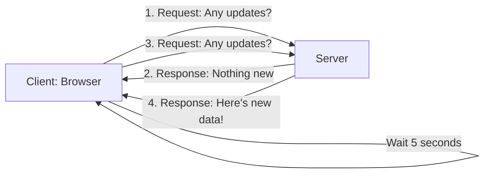
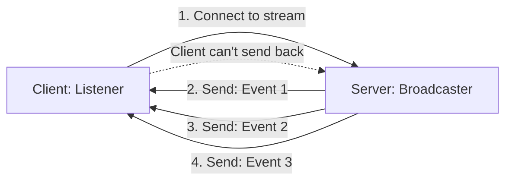
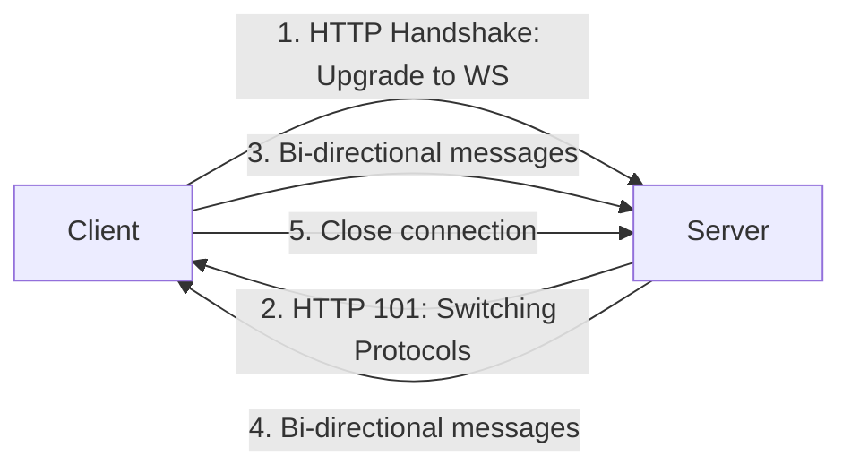
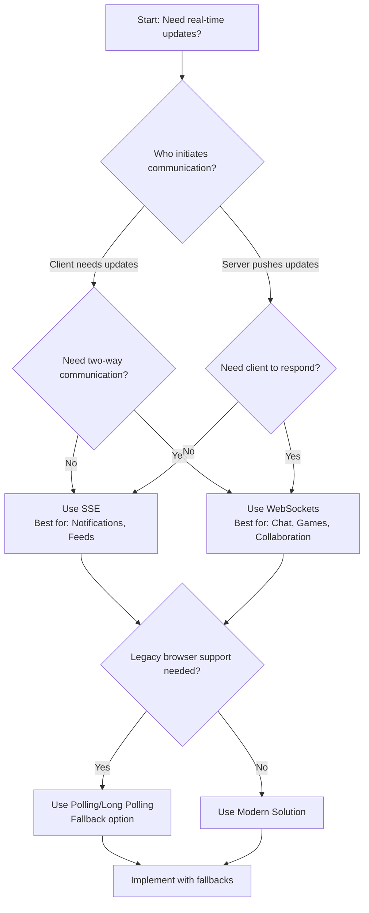

## 🔍 The Need for Real-Time Communication

Imagine you're waiting for an important email. You could:

* **Constantly check your inbox** (Polling - inefficient)
    
* **Get notified when it arrives** (SSE - one-way notifications)
    
* **Have a live chat with the sender** (WebSockets - two-way conversation)
    

Modern web applications need real-time updates. Stock tickers, live sports scores, chat applications, and collaborative tools all require different approaches to real-time communication.

---

## 📞 Traditional Polling Explained

### The "Phone Call Check" Analogy

Think of polling like calling a friend every 5 minutes to ask: *"Did anything new happen?"* Even when nothing has changed, you keep calling.



### Types of Polling

#### 1\. **Regular Polling**

```typescript
class PollingClient {
    private intervalId?: NodeJS.Timeout;
    private readonly endpoint: string;
    
    constructor(endpoint: string) {
        this.endpoint = endpoint;
    }
    
    start(pollingInterval: number = 5000): void {
        this.intervalId = setInterval(async () => {
            try {
                const response = await fetch(this.endpoint);
                const data = await response.json();
                this.handleData(data);
            } catch (error) {
                console.error('Polling error:', error);
            }
        }, pollingInterval);
    }
    
    stop(): void {
        if (this.intervalId) {
            clearInterval(this.intervalId);
        }
    }
    
    private handleData(data: any): void {
        console.log('Received:', data);
        // Update UI here
    }
}

// Usage
const stockTicker = new PollingClient('/api/stock-prices');
stockTicker.start(3000); // Check every 3 seconds
```

#### 2\. **Long Polling**

The server holds the request until there's data or timeout.

```typescript
class LongPollingClient {
    private isActive: boolean = true;
    
    async start(endpoint: string): Promise<void> {
        while (this.isActive) {
            try {
                const response = await fetch(endpoint, {
                    timeout: 30000 // Server holds for up to 30s
                });
                
                if (response.status === 200) {
                    const data = await response.json();
                    this.handleData(data);
                }
                
                // Immediately request again
                await this.start(endpoint);
                
            } catch (error) {
                console.error('Long polling error:', error);
                // Wait before retrying
                await new Promise(resolve => setTimeout(resolve, 1000));
            }
        }
    }
    
    stop(): void {
        this.isActive = false;
    }
    
    private handleData(data: any): void {
        console.log('Long polling received:', data);
    }
}
```

### Polling Pros & Cons

✅ **Pros:**

* Simple to implement
    
* Works everywhere (no special server support needed)
    
* Easy to debug
    

❌ **Cons:**

* High latency
    
* Wastes bandwidth (empty responses)
    
* Server load increases with more clients
    
* Not truly real-time
    

---

## 🔔 Server-Sent Events (SSE)

### The "Radio Station" Analogy

SSE is like listening to a radio station. The broadcaster (server) sends out messages, and you (client) just listen. You can't talk back through the radio.



### TypeScript Implementation

#### Server-Side (Node.js with Express)

```typescript
import express from 'express';
import type { Request, Response } from 'express';

const app = express();

app.get('/events', (req: Request, res: Response) => {
    // Set headers for SSE
    res.writeHead(200, {
        'Content-Type': 'text/event-stream',
        'Cache-Control': 'no-cache',
        'Connection': 'keep-alive',
        'Access-Control-Allow-Origin': '*'
    });
    
    // Send a keep-alive comment every 15 seconds
    const keepAlive = setInterval(() => {
        res.write(': keepalive\n\n');
    }, 15000);
    
    // Send actual events
    let eventId = 1;
    const sendEvent = () => {
        const data = {
            id: eventId,
            timestamp: new Date().toISOString(),
            message: `Event ${eventId}`,
            stockPrice: 100 + Math.random() * 10
        };
        
        res.write(`id: ${eventId}\n`);
        res.write(`event: priceUpdate\n`);
        res.write(`data: ${JSON.stringify(data)}\n\n`);
        
        eventId++;
    };
    
    // Send initial event
    sendEvent();
    
    // Send events every 3 seconds
    const interval = setInterval(sendEvent, 3000);
    
    // Clean up on client disconnect
    req.on('close', () => {
        clearInterval(interval);
        clearInterval(keepAlive);
        res.end();
    });
});

app.listen(3000, () => {
    console.log('SSE Server running on port 3000');
});
```

#### Client-Side Implementation

```typescript
class SSEClient {
    private eventSource: EventSource | null = null;
    private eventHandlers: Map<string, (data: any) => void> = new Map();
    
    connect(url: string): void {
        this.eventSource = new EventSource(url);
        
        // Default message handler (no event type)
        this.eventSource.onmessage = (event: MessageEvent) => {
            const data = JSON.parse(event.data);
            console.log('SSE Message:', data);
            this.dispatchEvent('message', data);
        };
        
        // Handle specific event types
        this.eventSource.addEventListener('priceUpdate', (event: MessageEvent) => {
            const data = JSON.parse(event.data);
            console.log('Price Update:', data);
            this.dispatchEvent('priceUpdate', data);
        });
        
        // Connection opened
        this.eventSource.onopen = () => {
            console.log('SSE Connection established');
            this.dispatchEvent('open', null);
        };
        
        // Error handling
        this.eventSource.onerror = (error: Event) => {
            console.error('SSE Error:', error);
            this.dispatchEvent('error', error);
        };
    }
    
    on(event: string, handler: (data: any) => void): void {
        this.eventHandlers.set(event, handler);
    }
    
    private dispatchEvent(event: string, data: any): void {
        const handler = this.eventHandlers.get(event);
        if (handler) {
            handler(data);
        }
    }
    
    disconnect(): void {
        if (this.eventSource) {
            this.eventSource.close();
            this.eventSource = null;
        }
    }
}

// Usage Example
const sseClient = new SSEClient();
sseClient.connect('http://localhost:3000/events');

sseClient.on('priceUpdate', (data) => {
    // Update stock price on UI
    document.getElementById('stock-price')!.textContent = `$${data.stockPrice.toFixed(2)}`;
});

sseClient.on('error', (error) => {
    console.error('Connection lost, attempting reconnect...');
    setTimeout(() => sseClient.connect('http://localhost:3000/events'), 5000);
});
```

### SSE Pros & Cons

✅ **Pros:**

* Truly real-time from server to client
    
* Automatic reconnection
    
* Efficient (single HTTP connection)
    
* Built into browsers (EventSource API)
    
* Text-based, human-readable protocol
    

❌ **Cons:**

* One-way only (server → client)
    
* Limited to UTF-8 text data
    
* Maximum concurrent connections per browser (6)
    
* No binary data support
    

---

## 🔄 WebSockets: Full-Duplex Communication

### The "Phone Call" Analogy

WebSockets are like a phone call. Once connected, both parties can talk and listen simultaneously, anytime. No need to hang up and call again.



### TypeScript Implementation

#### Server-Side (Node.js with ws library)

```typescript
import WebSocket, { WebSocketServer } from 'ws';
import { createServer } from 'http';
import { v4 as uuidv4 } from 'uuid';

interface Client {
    id: string;
    ws: WebSocket;
    isAlive: boolean;
}

class WebSocketServer {
    private wss: WebSocketServer;
    private clients: Map<string, Client> = new Map();
    
    constructor(port: number = 8080) {
        const server = createServer();
        this.wss = new WebSocketServer({ server });
        
        server.listen(port, () => {
            console.log(`WebSocket server running on port ${port}`);
        });
        
        this.setupConnectionHandling();
        this.startHeartbeat();
    }
    
    private setupConnectionHandling(): void {
        this.wss.on('connection', (ws: WebSocket, request) => {
            const clientId = uuidv4();
            const client: Client = { id: clientId, ws, isAlive: true };
            
            this.clients.set(clientId, client);
            console.log(`Client ${clientId} connected. Total: ${this.clients.size}`);
            
            // Send welcome message
            this.sendToClient(clientId, {
                type: 'welcome',
                id: clientId,
                timestamp: new Date().toISOString(),
                message: 'Connected to WebSocket server'
            });
            
            // Broadcast new connection to other clients
            this.broadcast({
                type: 'user_joined',
                userId: clientId,
                timestamp: new Date().toISOString(),
                activeUsers: this.clients.size
            }, clientId);
            
            // Message handler
            ws.on('message', (data: Buffer) => {
                this.handleMessage(clientId, data.toString());
            });
            
            // Connection close handler
            ws.on('close', () => {
                this.clients.delete(clientId);
                console.log(`Client ${clientId} disconnected. Total: ${this.clients.size}`);
                
                // Broadcast user left
                this.broadcast({
                    type: 'user_left',
                    userId: clientId,
                    timestamp: new Date().toISOString(),
                    activeUsers: this.clients.size
                });
            });
            
            // Pong response for heartbeat
            ws.on('pong', () => {
                const client = this.clients.get(clientId);
                if (client) {
                    client.isAlive = true;
                }
            });
        });
    }
    
    private handleMessage(clientId: string, message: string): void {
        try {
            const data = JSON.parse(message);
            console.log(`Message from ${clientId}:`, data);
            
            switch (data.type) {
                case 'chat_message':
                    // Broadcast chat message to all clients
                    this.broadcast({
                        type: 'chat_message',
                        userId: clientId,
                        message: data.message,
                        timestamp: new Date().toISOString()
                    });
                    break;
                    
                case 'private_message':
                    // Send private message to specific client
                    if (data.targetUserId && this.clients.has(data.targetUserId)) {
                        this.sendToClient(data.targetUserId, {
                            type: 'private_message',
                            from: clientId,
                            message: data.message,
                            timestamp: new Date().toISOString()
                        });
                    }
                    break;
            }
        } catch (error) {
            console.error('Error parsing message:', error);
        }
    }
    
    private sendToClient(clientId: string, data: any): void {
        const client = this.clients.get(clientId);
        if (client && client.ws.readyState === WebSocket.OPEN) {
            client.ws.send(JSON.stringify(data));
        }
    }
    
    private broadcast(data: any, excludeClientId?: string): void {
        this.clients.forEach((client, clientId) => {
            if (clientId !== excludeClientId && client.ws.readyState === WebSocket.OPEN) {
                client.ws.send(JSON.stringify(data));
            }
        });
    }
    
    private startHeartbeat(): void {
        // Check client connections every 30 seconds
        setInterval(() => {
            this.clients.forEach((client) => {
                if (!client.isAlive) {
                    client.ws.terminate();
                    this.clients.delete(client.id);
                    return;
                }
                
                client.isAlive = false;
                client.ws.ping();
            });
        }, 30000);
    }
}

// Start the server
const wsServer = new WebSocketServer(8080);
```

#### Client-Side Implementation

```typescript
enum WebSocketState {
    CONNECTING = 0,
    OPEN = 1,
    CLOSING = 2,
    CLOSED = 3
}

interface WebSocketMessage {
    type: string;
    [key: string]: any;
}

class WebSocketClient {
    private ws: WebSocket | null = null;
    private reconnectAttempts: number = 0;
    private maxReconnectAttempts: number = 5;
    private reconnectDelay: number = 1000;
    private messageHandlers: Map<string, (data: any) => void> = new Map();
    
    constructor(
        private url: string,
        private autoReconnect: boolean = true
    ) {}
    
    connect(): Promise<void> {
        return new Promise((resolve, reject) => {
            try {
                this.ws = new WebSocket(this.url);
                
                this.ws.onopen = () => {
                    console.log('WebSocket connected');
                    this.reconnectAttempts = 0;
                    this.dispatchEvent('open', null);
                    resolve();
                };
                
                this.ws.onmessage = (event: MessageEvent) => {
                    try {
                        const data: WebSocketMessage = JSON.parse(event.data);
                        console.log('WebSocket message:', data);
                        this.dispatchEvent(data.type, data);
                        this.dispatchEvent('message', data);
                    } catch (error) {
                        console.error('Error parsing message:', error);
                    }
                };
                
                this.ws.onclose = (event: CloseEvent) => {
                    console.log(`WebSocket closed: ${event.code} ${event.reason}`);
                    this.dispatchEvent('close', event);
                    
                    if (this.autoReconnect && this.reconnectAttempts < this.maxReconnectAttempts) {
                        this.scheduleReconnect();
                    }
                };
                
                this.ws.onerror = (error: Event) => {
                    console.error('WebSocket error:', error);
                    this.dispatchEvent('error', error);
                    reject(error);
                };
                
            } catch (error) {
                reject(error);
            }
        });
    }
    
    send(type: string, data?: any): boolean {
        if (this.ws && this.ws.readyState === WebSocketState.OPEN) {
            const message = { type, ...data };
            this.ws.send(JSON.stringify(message));
            return true;
        }
        return false;
    }
    
    on(event: string, handler: (data: any) => void): void {
        this.messageHandlers.set(event, handler);
    }
    
    private dispatchEvent(event: string, data: any): void {
        const handler = this.messageHandlers.get(event);
        if (handler) {
            handler(data);
        }
    }
    
    private scheduleReconnect(): void {
        this.reconnectAttempts++;
        const delay = this.reconnectDelay * Math.pow(1.5, this.reconnectAttempts - 1);
        
        console.log(`Reconnecting in ${delay}ms (attempt ${this.reconnectAttempts})`);
        
        setTimeout(() => {
            this.connect().catch(console.error);
        }, delay);
    }
    
    disconnect(code?: number, reason?: string): void {
        this.autoReconnect = false;
        if (this.ws) {
            this.ws.close(code || 1000, reason || 'Client disconnected');
        }
    }
    
    getState(): WebSocketState {
        return this.ws ? this.ws.readyState : WebSocketState.CLOSED;
    }
}

// Usage Example: Chat Application
class ChatApplication {
    private wsClient: WebSocketClient;
    private userId: string;
    
    constructor(url: string, userId: string) {
        this.userId = userId;
        this.wsClient = new WebSocketClient(url);
        
        this.setupEventHandlers();
        this.initializeUI();
    }
    
    async connect(): Promise<void> {
        await this.wsClient.connect();
        console.log('Connected to chat server');
    }
    
    private setupEventHandlers(): void {
        this.wsClient.on('welcome', (data) => {
            console.log('Server welcome:', data.message);
            this.displaySystemMessage(`Connected as ${this.userId}`);
        });
        
        this.wsClient.on('chat_message', (data) => {
            this.displayMessage(data.userId, data.message, false);
        });
        
        this.wsClient.on('user_joined', (data) => {
            this.displaySystemMessage(`User ${data.userId} joined (${data.activeUsers} online)`);
        });
        
        this.wsClient.on('user_left', (data) => {
            this.displaySystemMessage(`User ${data.userId} left (${data.activeUsers} online)`);
        });
    }
    
    private initializeUI(): void {
        const sendButton = document.getElementById('send-button')!;
        const messageInput = document.getElementById('message-input') as HTMLInputElement;
        
        sendButton.addEventListener('click', () => {
            this.sendMessage(messageInput.value);
            messageInput.value = '';
        });
        
        messageInput.addEventListener('keypress', (e) => {
            if (e.key === 'Enter') {
                this.sendMessage(messageInput.value);
                messageInput.value = '';
            }
        });
    }
    
    sendMessage(message: string): void {
        if (message.trim()) {
            this.wsClient.send('chat_message', {
                userId: this.userId,
                message: message.trim()
            });
            this.displayMessage(this.userId, message, true);
        }
    }
    
    private displayMessage(sender: string, message: string, isOwn: boolean): void {
        const chatBox = document.getElementById('chat-box')!;
        const messageElement = document.createElement('div');
        
        messageElement.className = `message ${isOwn ? 'own-message' : 'other-message'}`;
        messageElement.innerHTML = `
            <strong>${sender}:</strong>
            <span>${message}</span>
            <small>${new Date().toLocaleTimeString()}</small>
        `;
        
        chatBox.appendChild(messageElement);
        chatBox.scrollTop = chatBox.scrollHeight;
    }
    
    private displaySystemMessage(message: string): void {
        const chatBox = document.getElementById('chat-box')!;
        const messageElement = document.createElement('div');
        
        messageElement.className = 'system-message';
        messageElement.textContent = `⚡ ${message}`;
        
        chatBox.appendChild(messageElement);
        chatBox.scrollTop = chatBox.scrollHeight;
    }
    
    disconnect(): void {
        this.wsClient.disconnect(1000, 'User left chat');
    }
}

// Initialize chat
const chatApp = new ChatApplication('ws://localhost:8080', `User_${Math.floor(Math.random() * 1000)}`);
chatApp.connect().catch(console.error);
```

### WebSocket Pros & Cons

✅ **Pros:**

* True bidirectional communication
    
* Low latency (after connection established)
    
* Efficient (no HTTP overhead for each message)
    
* Supports binary and text data
    
* Can work over secure (WSS) and unsecured (WS) connections
    

❌ **Cons:**

* More complex implementation
    
* Requires server-side WebSocket support
    
* No automatic reconnection in base API
    
* Can be blocked by some corporate firewalls
    
* Load balancing is more complex
    

---

## 📊 Comparison & Decision Guide

### Quick Comparison Table

| Feature | Polling | Long Polling | SSE | WebSockets |
| --- | --- | --- | --- | --- |
| **Direction** | Client → Server | Client → Server | Server → Client | **Bidirectional** |
| **Protocol** | HTTP | HTTP | HTTP | **WS/WSS** |
| **Connection** | New per request | Held open | **Persistent** | **Persistent** |
| **Realtime** | No | Near real-time | **Yes** | **Yes** |
| **Overhead** | High (headers) | Medium | **Low** | **Very Low** |
| **Browser Support** | **All** | **All** | Modern browsers | **All modern** |
| **Data Types** | Any HTTP data | Any HTTP data | **Text only** | **Binary & Text** |
| **Auto Reconnect** | Manual | Manual | **Yes** | Manual |
| **Scalability** | Poor | Better | Good | **Excellent** |

### Decision Flowchart



### When to Use What?

#### **Use Polling When:**

* Building a simple prototype
    
* Supporting very old browsers
    
* Updates are infrequent (once per minute or less)
    
* You can't modify server infrastructure
    

#### **Use SSE When:**

* You only need server-to-client updates
    
* Building live news feeds, stock tickers, or notifications
    
* You want simplicity and automatic reconnection
    
* Text data is sufficient
    

#### **Use WebSockets When:**

* You need true bidirectional communication
    
* Building chat applications, multiplayer games, or collaborative tools
    
* Low latency is critical
    
* You need to send binary data (files, audio, video)
    

---

## 💻 TypeScript Implementation Examples

### Real-World Hybrid Solution

```typescript
// Hybrid Real-Time Communication Manager
type CommunicationMethod = 'websocket' | 'sse' | 'polling';

interface RealTimeConfig {
    preferredMethod: CommunicationMethod;
    fallbackMethods: CommunicationMethod[];
    endpoint: string;
    pollingInterval?: number;
    reconnectAttempts?: number;
}

interface RealTimeMessage {
    id: string;
    type: string;
    payload: any;
    timestamp: string;
}

class RealTimeCommunicationManager {
    private currentMethod: CommunicationMethod | null = null;
    private config: RealTimeConfig;
    private messageHandlers: Map<string, (message: RealTimeMessage) => void> = new Map();
    
    constructor(config: RealTimeConfig) {
        this.config = {
            pollingInterval: 5000,
            reconnectAttempts: 5,
            ...config
        };
    }
    
    async connect(): Promise<void> {
        const methods = [this.config.preferredMethod, ...this.config.fallbackMethods];
        
        for (const method of methods) {
            try {
                await this.attemptConnection(method);
                console.log(`Connected using ${method}`);
                this.currentMethod = method;
                return;
            } catch (error) {
                console.warn(`Failed to connect using ${method}:`, error);
            }
        }
        
        throw new Error('Failed to connect using any method');
    }
    
    private async attemptConnection(method: CommunicationMethod): Promise<void> {
        switch (method) {
            case 'websocket':
                return this.connectWebSocket();
            case 'sse':
                return this.connectSSE();
            case 'polling':
                return this.startPolling();
            default:
                throw new Error(`Unknown method: ${method}`);
        }
    }
    
    private connectWebSocket(): Promise<void> {
        return new Promise((resolve, reject) => {
            // WebSocket implementation from earlier
            // ... (use WebSocketClient class)
            resolve();
        });
    }
    
    private connectSSE(): Promise<void> {
        return new Promise((resolve, reject) => {
            // SSE implementation from earlier
            // ... (use SSEClient class)
            resolve();
        });
    }
    
    private startPolling(): Promise<void> {
        return new Promise((resolve) => {
            // Polling implementation from earlier
            // ... (use PollingClient class)
            resolve();
        });
    }
    
    send(message: RealTimeMessage): boolean {
        if (this.currentMethod === 'websocket') {
            // Send via WebSocket
            return true;
        } else if (this.currentMethod === 'sse' || this.currentMethod === 'polling') {
            // For SSE and polling, we need to use a separate HTTP request
            this.sendViaHTTP(message);
            return true;
        }
        return false;
    }
    
    private async sendViaHTTP(message: RealTimeMessage): Promise<void> {
        try {
            await fetch(this.config.endpoint, {
                method: 'POST',
                headers: { 'Content-Type': 'application/json' },
                body: JSON.stringify(message)
            });
        } catch (error) {
            console.error('Failed to send message:', error);
        }
    }
    
    on(messageType: string, handler: (message: RealTimeMessage) => void): void {
        this.messageHandlers.set(messageType, handler);
    }
    
    disconnect(): void {
        // Clean up all connections
        console.log('Disconnecting real-time communication');
    }
}

// Usage Example
const config: RealTimeConfig = {
    preferredMethod: 'websocket',
    fallbackMethods: ['sse', 'polling'],
    endpoint: 'ws://localhost:8080',
    pollingInterval: 3000
};

const realTimeManager = new RealTimeCommunicationManager(config);

realTimeManager.on('chat_message', (message) => {
    console.log('New chat message:', message.payload);
});

realTimeManager.on('stock_update', (message) => {
    console.log('Stock update:', message.payload);
});

// Connect with automatic fallback
realTimeManager.connect().then(() => {
    console.log('Real-time communication established');
}).catch(console.error);
```

---

## 🏆 Best Practices & Real-World Applications

### Security Considerations

```typescript
// Secure WebSocket Implementation
class SecureWebSocketClient {
    private ws: WebSocket | null = null;
    private messageQueue: string[] = [];
    private isAuthenticated: boolean = false;
    
    async connectWithAuth(url: string, authToken: string): Promise<void> {
        return new Promise((resolve, reject) => {
            // Add authentication token to URL or headers
            const wsUrl = new URL(url);
            wsUrl.searchParams.set('token', authToken);
            
            this.ws = new WebSocket(wsUrl.toString());
            
            // Implement message signing/verification
            this.ws.onmessage = (event) => {
                const message = JSON.parse(event.data);
                
                // Verify message signature if implemented
                if (this.verifyMessage(message)) {
                    this.handleMessage(message);
                } else {
                    console.warn('Message verification failed');
                }
            };
            
            // Rate limiting
            this.setupRateLimiting();
        });
    }
    
    private verifyMessage(message: any): boolean {
        // Implement message verification logic
        // This could check signatures, timestamps, etc.
        return true; // Simplified for example
    }
    
    private setupRateLimiting(): void {
        let messageCount = 0;
        const limit = 100; // messages per minute
        const interval = 60000; // 1 minute
        
        setInterval(() => {
            messageCount = 0;
        }, interval);
        
        // Check before sending each message
        const originalSend = this.ws!.send;
        this.ws!.send = (data: string) => {
            if (messageCount < limit) {
                messageCount++;
                originalSend.call(this.ws, data);
            } else {
                console.warn('Rate limit exceeded');
            }
        };
    }
}
```

### Performance Optimization Tips

1. **Connection Pooling:** Reuse connections when possible
    
2. **Compression:** Enable compression for text-heavy applications
    
3. **Message Batching:** Combine multiple updates into single messages
    
4. **Binary Protocols:** Use Protocol Buffers or MessagePack instead of JSON for large data
    
5. **Connection Prioritization:** Use different connections for different priority messages
    

### Monitoring & Debugging

```typescript
interface ConnectionMetrics {
    method: CommunicationMethod;
    connectionTime: number;
    messagesSent: number;
    messagesReceived: number;
    errors: number;
    latency: number[];
}

class RealTimeMonitor {
    private metrics: Map<string, ConnectionMetrics> = new Map();
    
    trackConnection(connectionId: string, method: CommunicationMethod): void {
        this.metrics.set(connectionId, {
            method,
            connectionTime: Date.now(),
            messagesSent: 0,
            messagesReceived: 0,
            errors: 0,
            latency: []
        });
    }
    
    recordMessageSent(connectionId: string): void {
        const metric = this.metrics.get(connectionId);
        if (metric) {
            metric.messagesSent++;
        }
    }
    
    recordLatency(connectionId: string, latency: number): void {
        const metric = this.metrics.get(connectionId);
        if (metric) {
            metric.latency.push(latency);
            // Keep only last 100 measurements
            if (metric.latency.length > 100) {
                metric.latency.shift();
            }
        }
    }
    
    getAverageLatency(connectionId: string): number {
        const metric = this.metrics.get(connectionId);
        if (!metric || metric.latency.length === 0) return 0;
        
        return metric.latency.reduce((sum, val) => sum + val, 0) / metric.latency.length;
    }
}
```

### Real-World Application Examples

1. **Stock Trading Platform:**
    
    * WebSockets for order execution
        
    * SSE for price updates
        
    * Polling for historical data
        
2. **Collaborative Document Editor:**
    
    * WebSockets for real-time collaboration
        
    * SSE for notifications
        
    * Polling for auto-save status
        
3. **Live Sports Updates:**
    
    * SSE for score updates
        
    * Polling for statistics
        
    * WebSockets for live chat
        

---

## 🎯 Conclusion

Choosing between WebSockets, Polling, and SSE depends on your specific requirements:

* **Polling** is your reliable fallback when nothing else works
    
* **SSE** is perfect for server-to-client notifications and feeds
    
* **WebSockets** excel when you need true bidirectional, low-latency communication
    

Modern applications often use a combination of these technologies. Start with WebSockets for bidirectional features, use SSE for notifications, and have polling as a fallback for maximum compatibility.

Remember to always:

* Implement proper error handling and reconnection logic
    
* Secure your connections (use WSS, validate messages)
    
* Monitor performance and adjust as needed
    
* Consider bandwidth and battery usage on mobile devices
    

The real-time web is here to stay, and choosing the right communication strategy will make your applications faster, more efficient, and more user-friendly.  
  
**Connect with us:**

* Hashnode: [**hashnode.com/@Nehal71**](http://hashnode.com/@Nehal71)
    
* Twitter : [**twitter.com/IngoleNehal**](http://twitter.com/IngoleNehal)
    
* LinkedIn: [**linkedin.com/in/nehal-ingole**](http://linkedin.com/in/nehal-ingole)
    
* GitHub : [**github.com/Ingole712521**](http://github.com/Ingole712521)